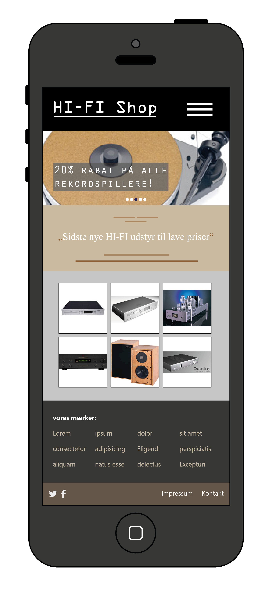
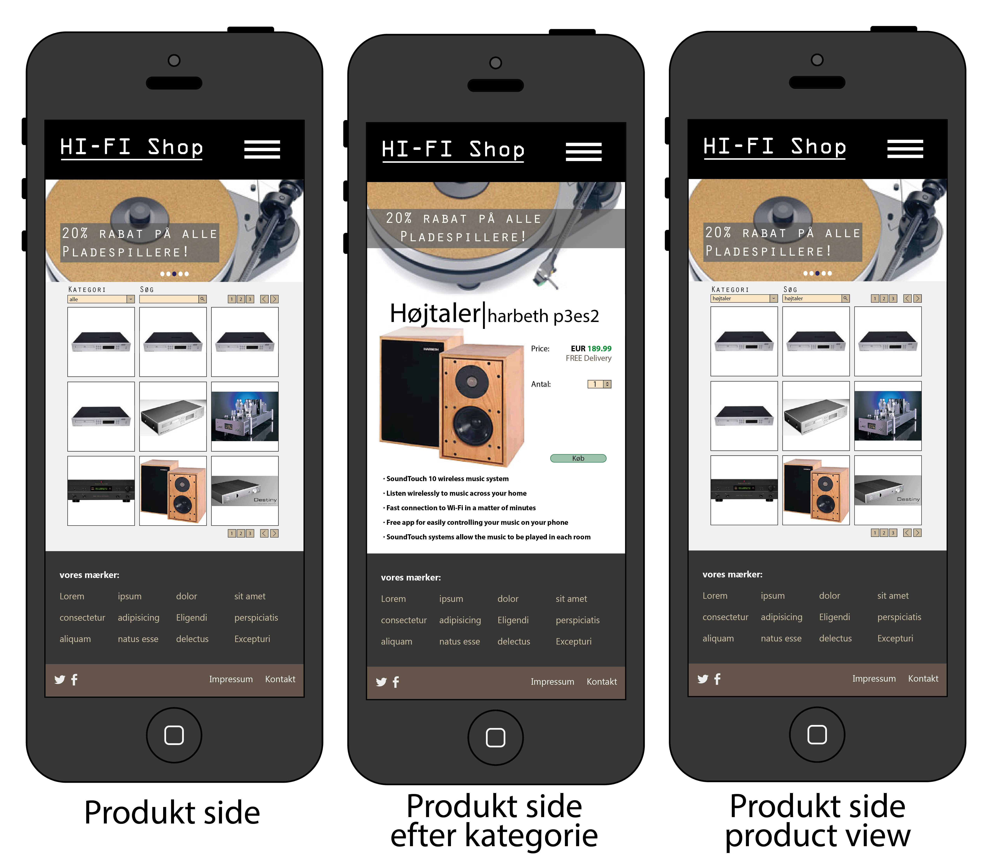
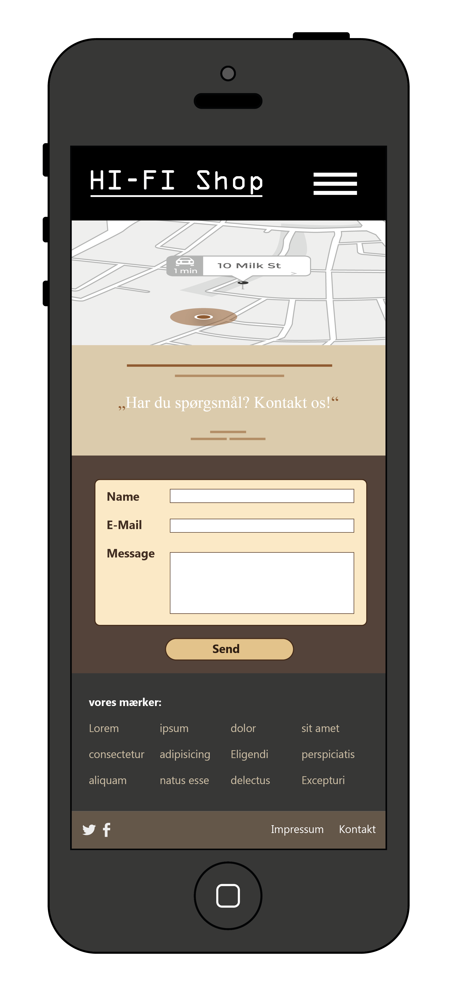

# HI-FI Projektopgave
## Arbejdsplan

### forventede arbejdsplan:
| timer         | opgave        | Tools |
|:-------------:|:-------------:|:-----:|
| 2             | layout        | Ai/Ps |
| 2             | wireframe     | Ai    |
| 0.5           | dummy HTML/CSS|Brackets|
| 1           | dummy Database|XAMPP/mySQL|
| 0.5           | modules til dataudtræk|VSCode|
| 0.5           | Opsæt server og routes|VSCode|

### opdateret arbejdsplan:
| timer         | opgave        | Tools |
|:-------------:|:-------------:|:-----:|
| 3             | layout        | Ai    |
| 5             | dummy HTML/CSS|Brackets|
| 0.5           | dummy Database|XAMPP/mySQL|
| -             | modules til dataudtræk|VSCode|
| -             | Opsæt server og routes|VSCode|

## Layouts

